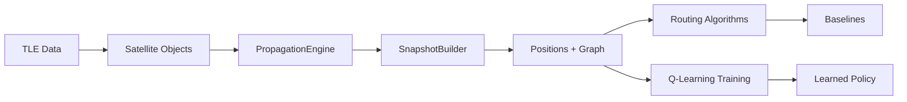
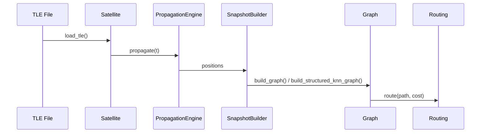

# Satellite Network Routing using Q-Learning

A research-grade simulation and reinforcement learning codebase for routing over dynamic LEO satellite constellations using the Iridium-66 topology. The project combines physics-based orbit propagation (SGP4 + TLE), network graph construction, queue-aware link costs, classical shortest-path baseline algorithms, and Q-learning agents that learn routing policies under time-varying connectivity.

## Setup

**Install dependencies from the repository root before running any training, scripts, or visualization tools:**

```bash
pip install -r requirements.txt
```

This must be done before running any experiments, training runs, or interactive visualization.

## Project Description

This repository simulates and trains reinforcement learning agents for routing in satellite networks based on the Iridium-66 constellation architecture. It provides:

- **Physics-driven orbit propagation** using SGP4 and real TLE data.
- **Dynamic graph construction** based on either distance thresholds or structured orbital neighbors.
- **Queue-aware link costs** that combine propagation delay and stochastic queueing delay.
- **Routing baselines** (Dijkstra, A*, Bellman-Ford) for rigorous comparison.
- **Q-learning training pipelines** for learning routing policies under dynamic topologies.
- **Interactive visualization** for live inspection of constellation state and routing paths.

### Why Satellite Routing Matters

LEO constellations are highly dynamic: satellites move rapidly, links appear and disappear, and latency changes with geometry and congestion. Routing decisions must be fast, robust, and adaptive. This project studies the tradeoffs between classical shortest-path routing (optimal but per-query expensive) and learned policies (amortized inference cost after training).

### Why Reinforcement Learning

Q-learning learns routing decisions from experience by optimizing long-term path cost. When trained across snapshots, it can amortize computation and respond quickly to changing topology, potentially outperforming repeated Dijkstra calls for large query volumes.

### Iridium-66 Inspiration

The Iridium-66 architecture is conceptually modeled as **6 orbital planes** with **11 satellites per plane** (66 total). This project uses TLE data to generate positions and derives orbital plane metadata to construct structured neighbor graphs that mimic grid-like adjacency (up/down/left/right).

## Features

- Real-world satellite propagation from TLE data (SGP4).
- Snapshot-based network graph construction with queue-aware link costs.
- Two topology models:
  - **Distance-threshold connectivity** (radius-based).
  - **Structured orbital neighbors** (plane-based KNN).
- Q-learning routing with epsilon-greedy exploration and convergence tracking.
- Dijkstra, A*, and Bellman-Ford baselines.
- Training pipelines with saved Q-tables, plots, and stats.
- Interactive Dash-based 3D visualization with routing overlays.
- Scripted test utilities for debugging propagation, topology, and routing.

## Repository Structure

```
.
├── .git/                          # Git metadata
├── .gitignore                     # Git ignore rules
├── .vscode/                        # Editor settings (local)
├── __pycache__/                    # Python bytecode cache (generated)
├── data/
│   └── iridium_tle.txt             # Iridium TLE dataset (primary input)
├── elements/
│   ├── __init__.py                 # Package marker
│   ├── propagation.py              # PropagationEngine wrapper
│   ├── satellite.py                # Satellite class + TLE loading utilities
│   └── snapshot.py                 # SnapshotBuilder for time-indexed graphs
├── interactive/
│   ├── app.py                      # Dash-based 3D live visualization
│   └── assets/
│       └── style.css               # UI styling for the dashboard
├── network/
│   ├── __init__.py                 # Package marker
│   ├── graph.py                    # Graph structure + topology builders
│   ├── link_cost.py                # Link cost and queueing models
│   ├── spatial.py                  # KD-tree spatial index
│   └── topology.py                 # Matplotlib plotting utilities
├── report.ipynb                    # Research notebook / experiment notes
├── requirements.txt                # Python dependencies for the project
├── routing/
│   ├── __init__.py                 # Package marker
│   ├── astar.py                    # A* routing baseline
│   ├── bellman_ford.py             # Bellman-Ford routing baseline
│   ├── dijkstra.py                 # Dijkstra routing baseline
│   └── qlearning.py                # Tabular Q-learning router
├── scripts/
│   ├── OLD_test_routing.py          # Legacy routing comparison script
│   ├── test_links.py               # Link visualization / snapshot stats
│   ├── test_propagator.py          # Propagation + routing smoke test
│   ├── test_snapshot.py            # Snapshot animation test
│   └── test_web_visualization.py   # Plotly-based orbit visualization
└── train/
    ├── outputs/                    # Generated training artifacts (plots, models, stats)
    ├── train_qlearning_dist.py     # Distance-threshold Q-learning training
    └── train_qlearning_snapshots.py# Structured-neighbor Q-learning training
```

### Folder Interactions

- **elements/** provides propagation and snapshot generation.
- **network/** builds graph structures and link cost models used by all routing.
- **routing/** contains routing algorithms used by training and scripts.
- **train/** orchestrates end-to-end Q-learning experiments and produces outputs.
- **interactive/** consumes SnapshotBuilder and routing to visualize live network state.
- **scripts/** serve as targeted debugging and validation tools.

## Architecture Overview



### Data Flow at Runtime



## Detailed File Documentation

### elements/satellite.py

**Purpose:** TLE parsing and satellite propagation interface.

**Core Class:** `Satellite`
- **Attributes:** `id`, `tle1`, `tle2`, `plane_id`, `raan_deg`, `mean_anomaly_deg`.
- **Method:** `propagate(t)`
  - Inputs: datetime or seconds offset.
  - Output: (x, y, z) position in km from SGP4.

**Core Functions:**
- `load_tle(file_path, max_sats=None, seed=None)`
  - Parses TLE file, optionally samples a subset.
  - Returns list of `Satellite` objects.
- Internal helpers for RAAN-based clustering and anomaly selection provide optional plane grouping logic.

**Interactions:** Used by SnapshotBuilder and all training/scripts.

### elements/propagation.py

**Purpose:** Lightweight propagation engine for batch satellite propagation.

**Core Class:** `PropagationEngine`
- **Method:** `propagate(t)`
  - Returns dict of `sat_id -> (x, y, z)` positions.

**Interactions:** Called inside SnapshotBuilder.

### elements/snapshot.py

**Purpose:** Build time-indexed network snapshots from propagated positions.

**Core Class:** `SnapshotBuilder`
- **Method:** `build_snapshot(...)`
  - Inputs: time `t`, `max_dist`, `link_model`, `queue_config`, `structured_knn`, `k_intra`, `k_inter`.
  - Output: dict containing `time`, `positions`, `graph`.
- Uses `build_graph` (radius-based) or `build_structured_knn_graph` (structured neighbors).
- Samples Poisson queue delays when `queue_config` is provided.

**Interactions:** Central dependency for training and visualization.

---

### network/graph.py

**Purpose:** Core graph structure and topology constructors.

**Core Class:** `Graph`
- `adj`: adjacency list of `(neighbor, weight)` edges.
- `edge_weights`: O(1) weight lookup.
- `node_metadata`: plane/RAAN/mean anomaly metadata.
- `set_queue_state(...)`: applies queue delays to edge weights.

**Core Functions:**
- `build_graph(positions, max_dist, link_model)`
  - Radius-based connectivity (distance threshold).
  - Adds reciprocal edges for undirected connectivity.
- `build_structured_knn_graph(positions, plane_map, k_intra, k_inter, link_model)`
  - Orbital-plane structured neighbors (grid-like adjacency).

**Interactions:** Used by SnapshotBuilder and routing algorithms.

### network/link_cost.py

**Purpose:** Link cost model (propagation + queue delay + congestion).

**Core Functions:**
- `propagation_delay(distance_km)`
- `queue_delay(queue_depth, service_rate)`
- `total_link_cost(...)`
- `sample_queue_lengths_poisson(...)` and `sample_queue_delays_poisson(...)`

**Core Class:** `LinkCostModel`
- Provides `link_cost(u, v, distance_km)` and `heuristic(distance_km)` for A*.

### network/spatial.py

**Purpose:** KD-tree spatial indexing for fast radius neighbor queries.

**Core Class:** `SpatialIndex`
- `radius_neighbors(max_dist)` returns neighbor indices + distances for graph building.

### network/topology.py

**Purpose:** Visualization helpers for topology plots.

**Key Functions:**
- `plot_graph`, `plot_path`
- `draw_edges`, `draw_edges_3d`
- `plot_graph_3d_matplotlib`
- `plot_rewards`, `plot_cost_evolution`

---

### routing/dijkstra.py

**Purpose:** Dijkstra baseline with standardized output.

**Key Functions:**
- `dijkstra(graph, source)`
- `dijkstra_with_pred(graph, source)`
- `route(graph, source, target)` returns `(path, cost, details)`.

### routing/astar.py

**Purpose:** A* baseline using propagation-delay heuristic.

**Key Function:**
- `a_star(graph, positions, source, target, link_model=None)`

### routing/bellman_ford.py

**Purpose:** Bellman-Ford baseline for comparison.

**Key Functions:**
- `bellman_ford(graph, source)`
- `route(graph, source, target)`

### routing/qlearning.py

**Purpose:** Tabular Q-learning router.

**Core Class:** `QLearningRouter`
- **State:** current node `u`.
- **Action:** next-hop neighbor `v`.
- **Q-value:** $Q(u, v)$ stored in a dictionary.
- **Reward:** negative link cost (normalized) plus terminal reward on success.

**Key Methods:**
- `select_action(u, explore=True)` for epsilon-greedy action selection.
- `update(u, v, reward, next_node)` for Bellman updates.
- `greedy_path(source, target, max_hops)` extracts a policy path.
- `train(source, target, episodes, ...)` runs episodic training.

---

### interactive/app.py

**Purpose:** Live 3D visualization and routing inspection with Dash.

**Key Features:**
- Live snapshot updates using `SnapshotBuilder`.
- Configurable max link distance and structured KNN toggles.
- Dijkstra path computation + Q-learning path overlay.
- Pause/rewind/speed controls.
- Live metrics: frame build time, Dijkstra time, Q-learning time.

**Core Functions:**
- `build_earth_surface(...)`: procedural Earth mesh.
- `build_link_traces(...)`: renders link edges + cost labels.
- `build_satellite_trace(...)`: per-satellite markers colored by plane.
- `build_path_trace(...)`: highlights Dijkstra and Q-learning routes.

---

### scripts/

**Purpose:** Targeted test and validation scripts (not unit tests).

- `test_links.py`: builds snapshots and prints graph statistics.
- `test_snapshot.py`: animates snapshots and topology edges in Matplotlib.
- `test_propagator.py`: smoke test for propagation and routing baselines.
- `test_web_visualization.py`: Plotly orbit visualization with SGP4.
- `OLD_test_routing.py`: legacy routing comparisons across baselines.

---

### train/train_qlearning_dist.py

**Purpose:** Primary training entry point (distance-based graph).

- Builds snapshots with **radius-based connectivity** (`max_dist`).
- Samples queue delays and applies them to link costs.
- Selects a distant source/target pair via BFS hop distance.
- Runs Q-learning and compares to Dijkstra baseline.
- Outputs Q-tables, plots, and detailed stats.

### train/train_qlearning_snapshots.py

**Purpose:** Primary training entry point (structured neighbor graph).

- Builds snapshots with **structured KNN connectivity** (`k_intra`, `k_inter`).
- Uses orbital plane metadata to define neighbors.
- Trains Q-learning with stable adjacency structure.
- Compares against Dijkstra and logs detailed metrics.

## Important Training Files

### 1) train/train_qlearning_dist.py

**Role:** Distance-based connectivity training and evaluation.

**Key Steps:**
1. Load Iridium TLEs and build snapshots at multiple time points.
2. Construct graphs by connecting satellites within `MAX_DIST_KM`.
3. Sample Poisson queue delays to modulate link costs.
4. Select a source-target pair separated by at least `min_hops`.
5. Run Q-learning (`QLearningRouter.train`) for multiple episode counts.
6. Compute Dijkstra baseline for comparison.
7. Save Q-tables, cost curves, and stats.

**Outputs:**
- `train/outputs/models/` (Q-tables)
- `train/outputs/plots/` (cost curves)
- `train/outputs/stats/` (summary metrics)

### 2) train/train_qlearning_snapshots.py

**Role:** Structured neighbor training and evaluation.

**Key Steps:**
1. Load Iridium TLEs and build snapshots with `structured_knn=True`.
2. Enforce **plane-based neighbor rules** (`k_intra`, `k_inter`).
3. Sample queue delays and apply link costs.
4. Choose a distant source-target pair using BFS.
5. Run Q-learning on a stable, grid-like topology.
6. Compare against Dijkstra baselines and log metrics.

**Outputs:** same as distance-based training, but for structured topology.

## Distance-Based Training Explanation (train_qlearning_dist.py)

**Connectivity Model**
- Satellites connect if Euclidean distance $
  d(u, v) \leq \texttt{MAX\_DIST\_KM}
  $.
- Edges are created dynamically at each snapshot because positions change.

**Implications**
- **Realistic:** reflects physical link feasibility.
- **Dynamic:** graph structure varies over time.
- **Harder RL problem:** agent must adapt to changing neighbors.
- **Variable density:** connectivity depends on spatial clustering.

**Routing Effects**
- Paths may appear/disappear between snapshots.
- Routing policies must generalize across topology shifts.

## Snapshot / Orbital Neighbor Training Explanation (train_qlearning_snapshots.py)

**Structured Neighbor Model**
- Each satellite is connected to neighbors in its orbital plane and adjacent planes.
- The structured KNN graph emulates **up/down/left/right** style neighbors.

**Orbital Plane Model**
- Iridium-66 is conceptualized as:
  - **6 orbital planes**
  - **11 satellites per plane**
  - **66 total satellites**
- Plane membership is derived from TLE metadata and used to drive KNN neighbor selection.

**Connectivity Rules**
- **Intra-plane:** `k_intra` neighbors ahead/behind in the same plane.
- **Inter-plane:** `k_inter` nearest neighbors in adjacent planes.

**Implications**
- **Stable adjacency:** connectivity is more deterministic across time.
- **Easier learning:** routing policy converges faster due to stable structure.
- **Predictable paths:** grid-like connectivity yields clearer routing patterns.

## Distance vs Snapshot Training Comparison

| Aspect | train_qlearning_dist.py | train_qlearning_snapshots.py |
|---|---|---|
| Connectivity model | Radius-based distance threshold | Structured plane-based KNN |
| Graph structure | Dynamic, geometry-driven | Stable, grid-like neighbors |
| Edge generation | Physical proximity only | Plane + nearest neighbor rules |
| Stability | Low (varies per snapshot) | High (consistent adjacency) |
| Realism | Higher physical realism | Higher structural regularity |
| RL difficulty | Harder (non-stationary graph) | Easier (stable topology) |
| Convergence | Slower | Faster / more stable |
| Compute cost | Higher (dense neighbor checks) | Lower / structured |
| Use cases | Physical realism, robustness | Policy learning, repeatability |

## Testing Scripts (scripts/)

The `scripts/` folder provides lightweight debugging utilities. Each script focuses on a specific subsystem and can be run directly:

```bash
python scripts/test_snapshot.py
python scripts/test_links.py
python scripts/test_propagator.py
python scripts/test_web_visualization.py
```

Typical categories include:
- Environment testing
- Satellite topology validation
- RL debugging
- Graph connectivity checks
- Visualization tests
- Routing sanity checks

## Interactive Visualization (interactive/)

The `interactive/` folder hosts a Dash-based web visualization.

Launch it with:

```bash
python interactive/app.py
```

**Capabilities:**
- Live 3D rendering of satellites and links.
- Dijkstra path highlighting between selected satellites.
- Q-learning path overlay (after training).
- Playback controls (pause, rewind, speed).
- Live metrics for frame build time and routing latency.

## Training and Outputs

### Run distance-based training

```bash
python train/train_qlearning_dist.py
```

### Run snapshot/structured training

```bash
python train/train_qlearning_snapshots.py
```

### Outputs

Training pipelines write:
- **Q-tables** (pickle) for learned policies.
- **Cost curves** as PNG plots.
- **Stats** text files summarizing convergence and routing metrics.

Outputs are collected under:

```
train/outputs/
```

## Reinforcement Learning Details

### Q-Learning Formulation

- **State:** current satellite node $u$.
- **Action:** next-hop neighbor $v$.
- **Q-value:** expected discounted return for $(u, v)$.

$$
Q(u, v) \leftarrow Q(u, v) + \alpha \bigl(r + \gamma \max_{a'} Q(v, a') - Q(u, v)\bigr)
$$

### Reward Design

- Negative link cost normalized by median edge weight.
- Terminal reward when the target is reached.

### Exploration vs Exploitation

- Epsilon-greedy policy chooses random neighbors with probability $\epsilon$.
- Epsilon decays over episodes to shift toward exploitation.

### Routing Interpretation

- Learned policy corresponds to a greedy routing strategy over $Q(u, v)$.
- Rewards reflect total latency; the agent learns low-cost, multi-hop paths.

## Satellite Networking Concepts

- **Orbital planes:** groups of satellites with similar RAAN.
- **Inter-satellite links (ISLs):** dynamic links based on distance and line-of-sight.
- **Dynamic topology:** LEO satellites move quickly; connectivity evolves over time.
- **Latency model:** propagation delay + queueing delay.
- **Routing constraints:** limited neighbor sets, dynamic edge availability.

## Developer Notes and Extensions

Ideas for extending the project:

- Add multi-destination Q-learning (destination-conditioned Q).
- Replace Q-learning with policy gradients or DQN.
- Compare against heuristic-based algorithms like Max Flow.
- Add congestion-aware link costs using traffic simulation.
- Scale to larger constellations (Starlink, OneWeb).
- Incorporate inter-plane handoff models and ISL failures.
- Add evaluation metrics like stretch, throughput, or energy.


## References
- Celestrak (https://celestrak.org/) - TLEs of Iridium NEXT satellites
- Ahmed E. Riyad, Medhat Mokhtar, Mohamed A. Belal, Mahmoud Mohamed Bahloul. "A q-learning approach for enhanced routing in dynamic LEO satellite networks." (https://doi.org/10.1016/j.ejrs.2025.05.002)
- Ding, Zhaolong, Huijie Liu, Feng Tian, Zijian Yang and Nan Wang. “Fast-Convergence Reinforcement Learning for Routing in LEO Satellite Networks.” (https://www.mdpi.com/1424-8220/23/11/5180)
- Xiaoting Wang, Zhiqi Dai, Zhao Xu. "LEO Satellite Network Routing Algorithm Based on Reinforcement Learning." (https://ieeexplore.ieee.org/document/9451072)
- Yixin HUANG, Shufan WU, Zeyu KANG, Zhongcheng MU, Hai HUANG, Xiaofeng WU, Andrew Jack TANG, Xuebin CHENG. "Reinforcement learning based dynamic distributed routing scheme for mega LEO satellite networks." (https://doi.org/10.1016/j.cja.2022.06.021)
---

## License

No explicit license file is included in the repository. Add one if you plan to distribute or publish this code publicly.
